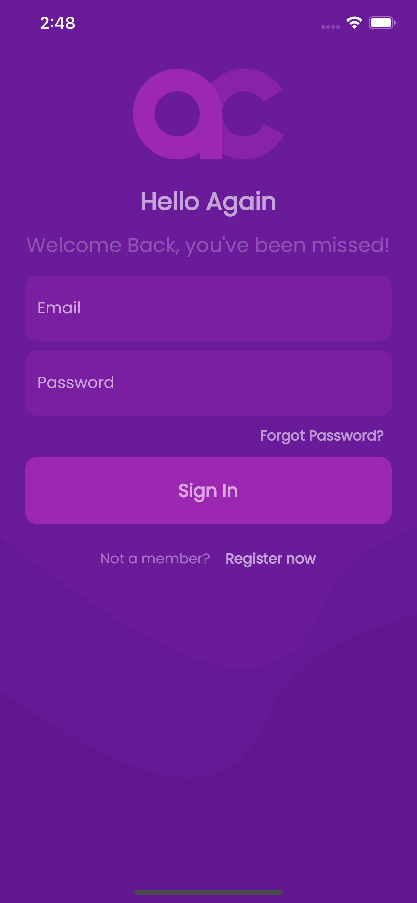
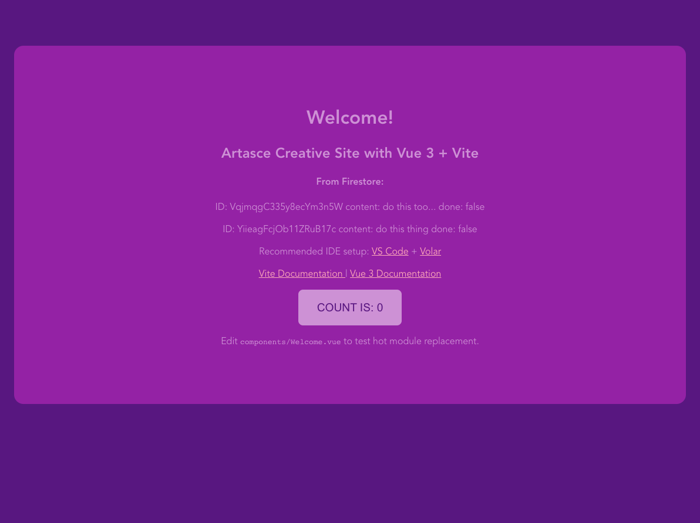
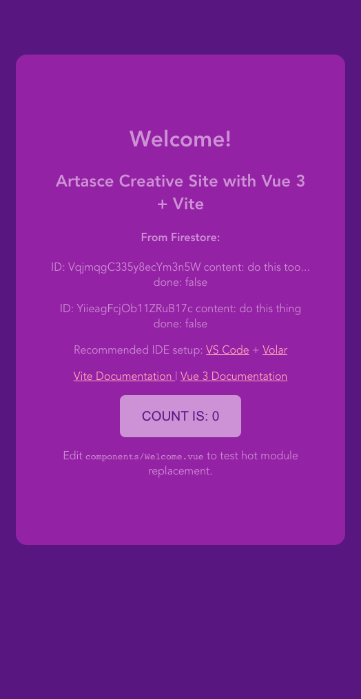

# Artasce Website AC Site

Vite + Vue 3 + Firebase + Vue Router 


## Theme Integration 

Goals include the maximum flex... theme and color mode options... darkmode/system, themeable design system. Also, the ability to merge design tokens accross platforms/frameworks AND implementations such as tailwind, css-in-js, daisy-ui, styled components, vanilla, etc...

Getting a design system model to follow is a current research task, with all of the above in mind, key elements include the design tokens, single source of truth, remote config, resource sharing, version control, cdn and other assets to share/publish/sync.

The current theme integration task list...

  - [ ] DARK MODE / COLOR SCHEME
  - [ ] CSS VARIABLES, TOKEN NAMING
  - [ ] GET DESIGN TOKENS IMPLEMENTED
    - [ ] research
    - [ ] list of formats
    - [ ] XD / ID / Online / Styleguide
  - [ ] CREATE XD DESIGN SYSTEM 
  - [ ] Consider location/site/maintainence
  - [ ] EXPLORE INTEGRATIONS ACROSS PLATFORMS/FRAMEWORKS


Mobile App Login Screen -

 

----------

Web Application in the Artasce Website system/project...

 


Live Demo:
https://artascecreative.web.app

## Firebase Integration

Current Integration Includes:

-   Firebase hosting
    - https://artascecreative.web.app 
    - target name is ``ac-site``
- Firebase firestore 
  - read only
  - App.vue display 
- Firebase db File
  - Setup .env with Vite (import.meta.env.VITE_*)
  - /firebase/index.js exports db

## Vue router

Added vue-router@latest... added Nav component, added routes...

```

// routes 
routes/index.js

```

#### /firebase.json

- `` ac-site ``    is the target hosting nickname for artascecreative.web hosting uner the **Artasce Website** project.
- firebase firestore is initialized


```

{
  "hosting": {
    "target": "ac-site",
    "public": "dist",
    "ignore": [
      "firebase.json",
      "**/.*",
      "**/node_modules/**"
    ],
    "rewrites": [
      {
        "source": "**",
        "destination": "/index.html"
      }
    ]
  },
  "firestore": {
    "rules": "firestore.rules",
    "indexes": "firestore.indexes.json"
  }
}

```

## First...

First sprint is to establish a read connection to firebase project, use .env for config, show firestore data... Upon that, organize and encapsulate minimal setup structure before specific customizations and use this as a seed/template for the Artasce Website System sattelite sites with VUE 3 + Vite + Firebase

#### Current Package is still lean

```

{
  "name": "artascecreative",
  "private": true,
  "version": "0.0.0",
  "scripts": {
    "dev": "vite",
    "build": "vite build",
    "preview": "vite preview"
  },
  "dependencies": {
    "firebase": "^9.9.0",
    "vue": "^3.2.25",
    "vue-router": "^4.0.13"
  },
  "devDependencies": {
    "@vitejs/plugin-vue": "^2.3.3",
    "vite": "^2.9.9"
  }
}


```

###

### Vue 3 + Vite Starter Project

This template should help get you started developing with Vue 3 in Vite. The template uses Vue 3 `<script setup>` SFCs, check out the [script setup docs](https://v3.vuejs.org/api/sfc-script-setup.html#sfc-script-setup) to learn more.

## Recommended IDE Setup

- [VS Code](https://code.visualstudio.com/) + [Volar](https://marketplace.visualstudio.com/items?itemName=Vue.volar)

