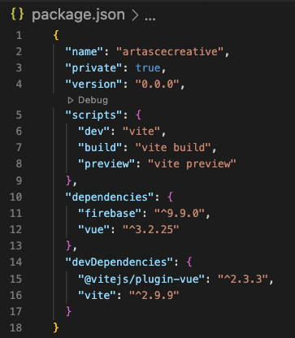

# Artasce Website AC Site

https://artascecreative.web.app

## Firebase Integration

Current Integration Includes:

-   Firebase hosting
    - https://artascecreative.web.app 
    - target name is ``ac-site``
- Firebase firestore 
  - read only

- App.vue display coming soon...
- View console to see collection objects... connected
- Added firebase db
- Setup .env with Vite
  - import.meta.env.VITE_*


#### /firebase.json

- `` ac-site ``    is the target hosting nickname for artascecreative.web hosting uner the **Artasce Website** project.
- firebase firestore is initialized


```

{
  "hosting": {
    "target": "ac-site",
    "public": "dist",
    "ignore": [
      "firebase.json",
      "**/.*",
      "**/node_modules/**"
    ],
    "rewrites": [
      {
        "source": "**",
        "destination": "/index.html"
      }
    ]
  },
  "firestore": {
    "rules": "firestore.rules",
    "indexes": "firestore.indexes.json"
  }
}

```

## First...

First sprint is to establish a read connection to firebase project, use .env for config, show firestore data... Upon that, organize and encapsulate minimal setup structure before specific customizations and use this as a seed/template for the Artasce Website System sattelite sites with VUE 3 + Vite + Firebase

#### Current Package is lean... 




###

### Vue 3 + Vite Starter Project

This template should help get you started developing with Vue 3 in Vite. The template uses Vue 3 `<script setup>` SFCs, check out the [script setup docs](https://v3.vuejs.org/api/sfc-script-setup.html#sfc-script-setup) to learn more.

## Recommended IDE Setup

- [VS Code](https://code.visualstudio.com/) + [Volar](https://marketplace.visualstudio.com/items?itemName=Vue.volar)

